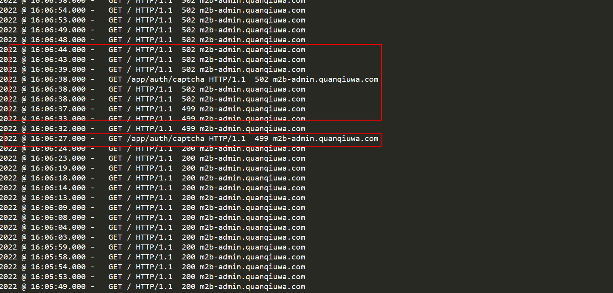

## 创业未半，而中道崩殂
经过0.5坤年的开发，系统开始发布到正式环境开始试运行，

同时运维也对公司服务器资源进行了调整，项目使用的是docker构建，选择了轻量的linux版本镜像，使用open jdk1.8

但是不出意外的话意外就要来了，营销人员开始有人反馈："系统怎么突然不能用了","怎么登录不了"。

接到反馈后我也是马上查ES日志，结果发现怎么出现了"佛珠保佑，永不宕机，永无BUG"的启动banner图，项目怎么自动重启了。
```bash
////////////////////////////////////////////////////////////////////
//                          _ooOoo_                               //
//                         o8888888o                              //
//                         88" . "88                              //
//                         (| ^_^ |)                              //
//                         O\  =  /O                              //
//                      ____/`---'\____                           //
//                    .'  \\|     |//  `.                         //
//                   /  \\|||  :  |||//  \                        //
//                  /  _||||| -:- |||||-  \                       //
//                  |   | \\\  -  /// |   |                       //
//                  | \_|  ''\---/''  |   |                       //
//                  \  .-\__  `-`  ___/-. /                       //
//                ___`. .'  /--.--\  `. . ___                     //
//              ."" '<  `.___\_<|>_/___.'  >'"".                  //
//            | | :  `- \`.;`\ _ /`;.`/ - ` : | |                 //
//            \  \ `-.   \_ __\ /__ _/   .-` /  /                 //
//      ========`-.____`-.___\_____/___.-`____.-'========         //
//                           `=---='                              //
//      ^^^^^^^^^^^^^^^^^^^^^^^^^^^^^^^^^^^^^^^^^^^^^^^^^^        //
//            佛祖保佑       永不宕机      永无BUG                //
///////////////////////////////////////////////////////////////////
```

## 排查之路
**第一回合：JVM**

我首先想到的就是 JVM 出了问题。我掏出了 Arthas 这个神器，对着测试环境一顿猛查。结果令人大跌眼镜：
1. GC 正常，甚至比我电脑上还健康
2. 线程正常，没有任何阻塞的迹象
3. CPU 和内存使用率低得离谱，仿佛在摸鱼

**第二回合：在佛祖保佑之前**

就在我一筹莫展的时候，再次翻看日志发现"佛祖保佑"前面还有几行平时没有见过的日志
```bash
SIGILL (0x4) at pc=0x00007f513982afa1, pid=6, tid=0x00007f51469b6ab0 
JRE version: OpenJDK Runtime Environment (8.0_111-b14) 
(build 1.8.0_111-internal-alpine-r0-b14) 
Java VM: OpenJDK 64-Bit Server VM (25.111-b14 mixed mode linux-amd64 compressed oops) 
Problematic frame: 
C [libawt.so+0x2dfa1] AnyIntIsomorphicCopy+0x61 
Core dump written. Default location: //core or core.6 
An error report file with more information is saved as: //hs_err_pid6.log  
```

看不懂是什么东西，hs_err_pid6.log日志内容也是这段话，googel了一圈并没有找到有用的信息。

只是在搜索`C [libawt.so+0x2dfa1] `的时候找到了可能跟图形图像动态库有关的信息。

可是小组里想了一圈没想到有什么跟图形图像有关的功能。

**第三回合：Nginx 的 449与502状态吗**

在定位问题的期间，系统又发生了几次重启。

在排查无果后，突然我想到了既然系统会重启，那么重启的期间系统就无法接收请求，是否可以从重启前的最后一个请求入手，判断什么请求触发了什么功能导致了系统重启。

于是我们请运维帮我们捞到了Nginx的access日志。果然发现了请求登录验证码的时候出现异常状态码449、502。
并且这种情况是偶发的并不是每次请求登录验证码都会。


::: tip 
```bash
499 ‌：表示客户端在服务器完成响应前主动关闭了连接‌

（如浏览器关闭、客户端超时或微服务调用方中断）。

502 ‌：表示作为网关或代理的服务器收到了无效、非法或无法解析的响应‌，或连接被提前中断

（如后端进程崩溃、端口不通、超时退出）。

```
:::

**真相大白**

结合之前搜索到的libawt.so是图形图像有关的本地包，一个大胆的推理在我脑海中形成：凶手就是验证码。

查看验证码的生成逻辑，显示随机一个四位的字符串，然后调用 Hutool 工具类生成的图形验证码

但是为什么在我们本地开发的时候就不会呢？

查了资料后发现libawt.so在 Windows 上有完整的图形环境支持，所以并不会触发重启

**论据验证**

调整验证码生成逻辑，重启服务，观察了几天，项目并没有重启故定位是服务器环境的图形库导致